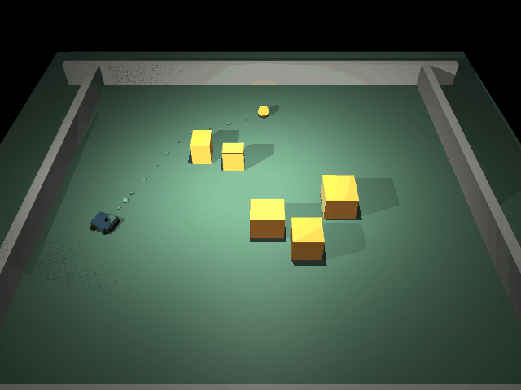
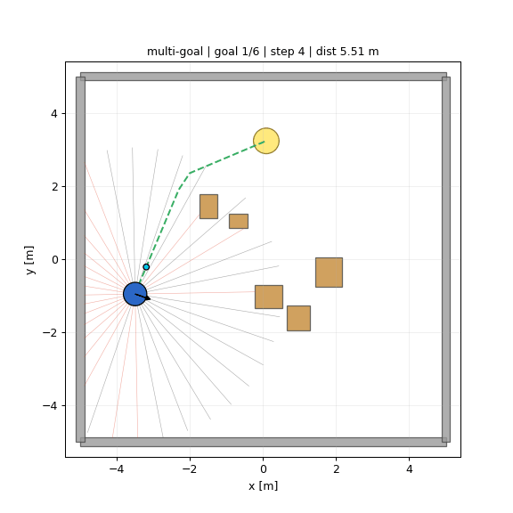
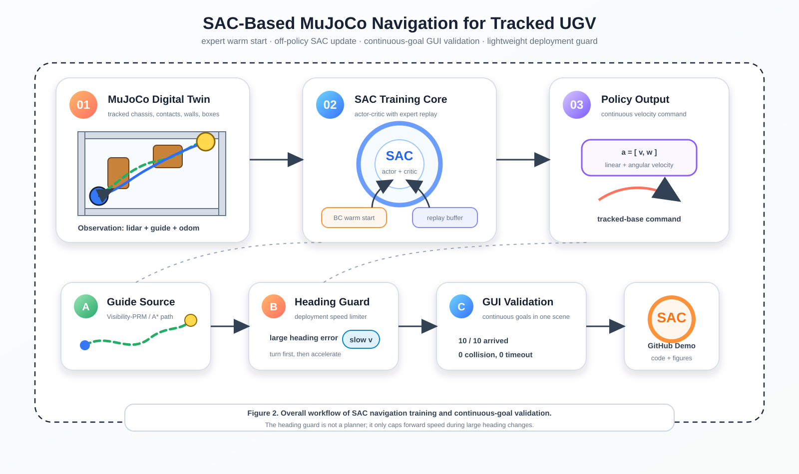
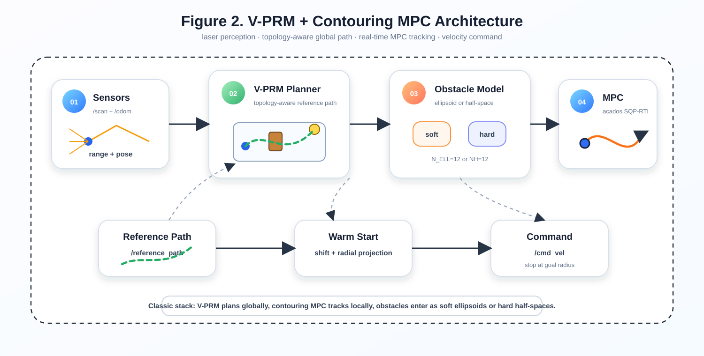

# 基于拓扑优化的无人小型车辆规划算法

Planning Algorithm for Unmanned Small Vehicles Based on Topology Optimization

[](LICENSE)


<a id="zh-cn"></a>

**中文** | [English](#english)

本仓库包含两条小型无人车导航路线：

- `multi_ugv_planner/`：V-PRM 全局规划 + Contouring MPC 路径跟踪与避障
- [`RL/`](RL/README.md)：MuJoCo 动力学环境下的强化学习导航验证

## MuJoCo 3D 演示

当前 RL 演示使用履带式 UGV、MuJoCo 碰撞动力学、激光观测和连续目标切换。展示策略为 SAC checkpoint 加轻量转向保护，主要用于验证策略能否在同一场景中连续完成多个目标点。

<p align="center">
  
  
</p>

<p align="center">
  
</p>

## 传统规划方法

传统路线是 ROS 2 Humble 下的 V-PRM + Contouring MPC 导航栈。V-PRM 负责根据激光点云生成绕障参考路径，MPC 负责实时跟踪路径并处理障碍约束。

<p align="center">
  
</p>

<p align="center">
  
</p>

```bash
cd <ros2_ws>/src
cp -r <this_repo> multi_ugv_planner
cd <ros2_ws>
source /opt/ros/humble/setup.bash
colcon build --packages-select multi_ugv_planner
source install/setup.bash

ros2 run multi_ugv_planner fake_odom.py &
ros2 run multi_ugv_planner fake_scan.py &
ros2 launch multi_ugv_planner ugv_mpc.launch.py
```

障碍约束模式可在 `config/ugv_params.yaml` 中切换：

```yaml
mpc:
  use_linear_constraints: true
```

`true` 使用线性化半空间硬约束，`false` 使用椭球软惩罚。

## RL 导航

[`RL/`](RL/README.md) 目录保留早期 PPO baseline，并加入当前 MuJoCo SAC 实验。仓库内包含环境、训练脚本、评估脚本、曲线和展示媒体；大体积 checkpoint 不直接提交。

```bash
cd RL/fishbot_mujoco_sac
python3.12 -m venv mujoco_env
source mujoco_env/bin/activate
pip install torch --index-url https://download.pytorch.org/whl/cu128
pip install -r requirements.txt

PYTHONUNBUFFERED=1 PYTHONPYCACHEPREFIX=/tmp/fishbot_pycache ./mujoco_env/bin/python scripts/view_multigoal_dyn.py \
  --model runs_dyn/sac_20260825_010443/best_model.zip \
  --stage 3 --scene boxes \
  --goals 10 \
  --seed 2 \
  --sleep 0.03 \
  --goal-radius 0.35 \
  --max-steps-per-goal 900 \
  --heading-guard
```

当前说明：裸 SAC checkpoint 还不是所有随机种子都稳定。公开演示使用一个很轻的 heading guard，避免连续目标切换时高速大半径转弯。

## 目录结构

```text
.
├── multi_ugv_planner/          # ROS 2 Python 节点：V-PRM、fake odom、fake scan
├── include/multi_ugv_planner/  # MPC solver 头文件
├── src/                        # Contouring MPC 与 planner node
├── config/ugv_params.yaml      # 主规划器参数
├── launch/ugv_mpc.launch.py    # ROS 2 launch 文件
├── docs/images/                # 传统规划图
└── RL/                         # MuJoCo RL 导航分支
```

## 许可证

Apache-2.0. See [LICENSE](LICENSE).

---

<a id="english"></a>

## English

[中文](#zh-cn) | **English**

This repository contains two navigation routes for a small unmanned ground vehicle:

- `multi_ugv_planner/`: V-PRM global planning with Contouring MPC tracking and obstacle avoidance
- [`RL/`](RL/README.md): reinforcement-learning navigation validation in MuJoCo

## MuJoCo 3D Demo

The current RL demo uses a tracked UGV, MuJoCo collision dynamics, lidar-style observations, and consecutive goal switching. The showcased policy is a SAC checkpoint with a lightweight heading guard for continuous-goal validation.

<p align="center">
  
  
</p>

<p align="center">
  
</p>

## Classic Planner

The classic route is a ROS 2 Humble navigation stack built around V-PRM and Contouring MPC. V-PRM generates an obstacle-aware reference path from lidar points, while MPC tracks the path and handles obstacle constraints in real time.

<p align="center">
  
</p>

<p align="center">
  
</p>

```bash
cd <ros2_ws>/src
cp -r <this_repo> multi_ugv_planner
cd <ros2_ws>
source /opt/ros/humble/setup.bash
colcon build --packages-select multi_ugv_planner
source install/setup.bash

ros2 run multi_ugv_planner fake_odom.py &
ros2 run multi_ugv_planner fake_scan.py &
ros2 launch multi_ugv_planner ugv_mpc.launch.py
```

Obstacle handling can be switched in `config/ugv_params.yaml`:

```yaml
mpc:
  use_linear_constraints: true
```

`true` uses linearized hard half-space constraints. `false` uses soft ellipsoid penalties.

## RL Navigation

The [`RL/`](RL/README.md) folder keeps the earlier PPO baseline and adds the current MuJoCo SAC experiment. The public files include the environment, training scripts, evaluation scripts, curves, and demo media. Large trained checkpoints are not committed to the repository.

```bash
cd RL/fishbot_mujoco_sac
python3.12 -m venv mujoco_env
source mujoco_env/bin/activate
pip install torch --index-url https://download.pytorch.org/whl/cu128
pip install -r requirements.txt

PYTHONUNBUFFERED=1 PYTHONPYCACHEPREFIX=/tmp/fishbot_pycache ./mujoco_env/bin/python scripts/view_multigoal_dyn.py \
  --model runs_dyn/sac_20260825_010443/best_model.zip \
  --stage 3 --scene boxes \
  --goals 10 \
  --seed 2 \
  --sleep 0.03 \
  --goal-radius 0.35 \
  --max-steps-per-goal 900 \
  --heading-guard
```

Current note: the raw SAC checkpoint is not yet robust in every tested seed. The public demo uses a small heading guard to reduce wide, high-speed turns during goal switching.

## Project Layout

```text
.
├── multi_ugv_planner/          # ROS 2 Python nodes: V-PRM, fake odom, fake scan
├── include/multi_ugv_planner/  # MPC solver headers
├── src/                        # Contouring MPC and planner node
├── config/ugv_params.yaml      # Main planner parameters
├── launch/ugv_mpc.launch.py    # ROS 2 launch file
├── docs/images/                # Classic planner figures
└── RL/                         # MuJoCo RL navigation branch
```

## License

Apache-2.0. See [LICENSE](LICENSE).
