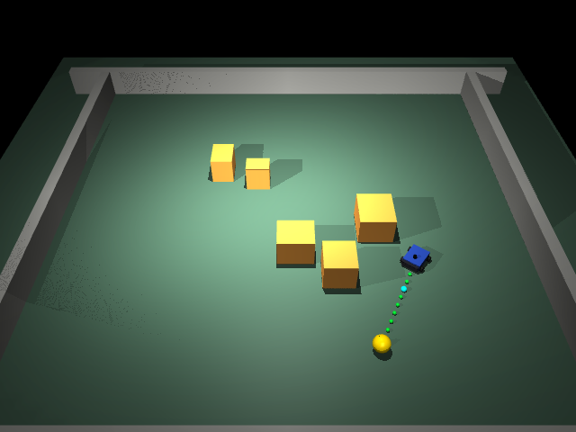

# Fishbot RL: MuJoCo Navigation

This folder contains the reinforcement-learning navigation branch of the small UGV planning project. It includes the earlier PPO baseline and the current SAC + MuJoCo continuous-goal demo.

## Demo

The current visual demo runs a tracked UGV in MuJoCo with lidar-style observations, real collision geometry, and consecutive goal switching.

<p align="center">
  
  
</p>

<p align="center">
  
  
</p>

## Current Result

Selected checkpoint:

```text
fishbot_mujoco_sac/runs_dyn/sac_20260825_010443/best_model.zip
```

The checkpoint is about 324 MB, so it is not committed to Git. Use Git LFS or a GitHub Release asset if the weight file needs to be shared.

| Policy | Safety layer | Seeds | Result |
| --- | --- | --- | --- |
| SAC checkpoint | none | 2, 7, 8, 10 | partially successful; seed 2 and 7 can still collide |
| SAC checkpoint | heading guard | 2, 7, 8, 10 | 8/8 goals, 0 collision in tested seeds |
| SAC checkpoint | heading guard | seed 2 GUI | 10/10 goals, 0 collision, 0 timeout |

<p align="center">
  
</p>

## Run

```bash
cd RL/fishbot_mujoco_sac
python3.12 -m venv mujoco_env
source mujoco_env/bin/activate
pip install torch --index-url https://download.pytorch.org/whl/cu128
pip install -r requirements.txt
```

```bash
PYTHONUNBUFFERED=1 PYTHONPYCACHEPREFIX=/tmp/fishbot_pycache ./mujoco_env/bin/python scripts/view_multigoal_dyn.py \
  --model runs_dyn/sac_20260825_010443/best_model.zip \
  --stage 3 --scene boxes \
  --goals 10 \
  --seed 2 \
  --sleep 0.03 \
  --goal-radius 0.35 \
  --max-steps-per-goal 900 \
  --heading-guard
```

The heading guard is not a planner. It only limits forward speed when the guide direction is far from the robot heading, which prevents large-radius turns during continuous goal switches.

## Files

```text
RL/
├── fishbot_mujoco_sac/
│   ├── assets/tracked_nav.xml      # MuJoCo tracked UGV scene
│   ├── scripts/env_dyn.py          # Gymnasium environment
│   ├── scripts/train_sac_dyn.py    # SAC training
│   ├── scripts/eval_dyn.py         # Evaluation
│   └── scripts/view_multigoal_dyn.py
├── docs/images/                    # GIFs and figures
├── docs/results/                   # Curves and evaluation summaries
├── train_mj_ppo.py                 # Earlier PPO baseline
└── docs/MODEL_CARD.md              # Checkpoint and validation notes
```

## Notes

The PPO baseline remains as a comparison route. The current work focus is SAC in MuJoCo, then ROS 2 bridging for later real-robot validation.
