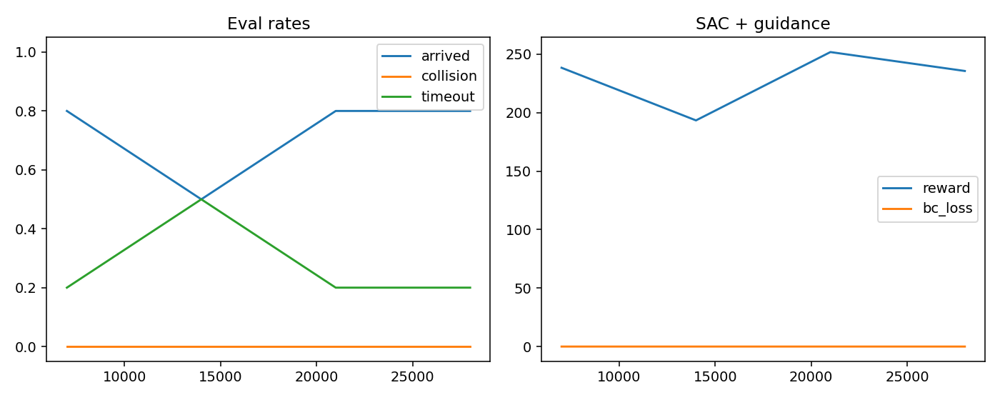

# Fishbot RL — MuJoCo Navigation
Reinforcement Learning Branch of the Topology-Optimization Planning Project

## SAC-MuJoCo Continuous-Goal Demo

This folder now includes a true-dynamics MuJoCo SAC navigation demo for a
tracked UGV. The current robust demo uses a SAC policy with a lightweight
heading guard for continuous-goal validation.


### Current SAC Result

Selected local checkpoint:

```text
/home/lu/RL/fishbot_mujoco/runs_dyn/sac_20260825_010443/best_model.zip
```

The checkpoint is about 324 MB, so it is not committed to Git. Publish it with
Git LFS or a GitHub Release asset if the trained weight needs to be shared.

| Policy | Safety layer | Seeds | Result |
| --- | --- | --- | --- |
| SAC checkpoint | none | 2, 7, 8, 10 | partially successful; seed 2 and 7 can still collide |
| SAC checkpoint | heading guard | 2, 7, 8, 10 | 8/8 goals, 0 collision in tested seeds |
| SAC checkpoint | heading guard | seed 2 GUI | 10/10 goals, 0 collision, 0 timeout |


Training curve:



### Run The SAC Demo

```bash
cd RL/fishbot_mujoco_sac
python3.12 -m venv mujoco_env
source mujoco_env/bin/activate
pip install torch --index-url https://download.pytorch.org/whl/cu128
pip install -r requirements.txt
```

```bash
PYTHONUNBUFFERED=1 PYTHONPYCACHEPREFIX=/tmp/fishbot_pycache ./mujoco_env/bin/python scripts/view_multigoal_dyn.py \
  --model runs_dyn/sac_20260825_010443/best_model.zip \
  --stage 3 --scene boxes \
  --goals 10 \
  --seed 2 \
  --sleep 0.03 \
  --goal-radius 0.35 \
  --max-steps-per-goal 900 \
  --heading-guard
```

The heading guard is not Visibility-PRM and does not change the planned path.
It only caps forward speed when the local guide direction is far from the robot
heading, which prevents high-throttle large-radius turns during continuous goal
switches.

See [`docs/MODEL_CARD.md`](docs/MODEL_CARD.md) for the checkpoint note and
validation details. The SAC code is in [`fishbot_mujoco_sac/`](fishbot_mujoco_sac/).

---

## PPO Baseline / Original RL Notes

Fishbot 两轮差速小车（ESP32 + YDLidar X2）的**端到端激光导航**分支，与主仓库的
V-PRM + Contouring MPC 经典规划路线形成对照：**同一台车、同一个 SquareWorld2 场景，
一条路线靠模型预测控制，一条路线靠强化学习从零学**。

```
主仓库:  /scan + /odom ─▶ V-PRM 全局规划 ─▶ acados Contouring MPC ─▶ /cmd_vel
ugv_rl: 90束激光 + 目标 ─▶ PPO 端到端策略 ─▶ (v_lin, w) ─▶ /cmd_vel
```

---

## 1. 任务定义

- **车体**：Fishbot 两轮差速，最大线速度 0.28 m/s，最大角速度 2.0 rad/s（真车动力学）
- **传感器**：90 束激光（模拟 YDLidar X2，带 0.02m 高斯噪声 + 5% 丢帧，sim2real 对齐）
- **观测**（94 维）：90 束激光归一化 + [目标距离/15, 目标方位角/π, 线速度, 角速度]
- **动作**（2 维）：(前进比例, 转向比例) ∈ [-1,1]² → 目标速度 (v_lin, w)
- **场景**：gazebo SquareWorld2（红房子/十字/三角/L/家具），阶段训练时**障碍放在地图中央，
  起点与终点在其两侧** —— 直线必被遮挡，必须真正绕行

## 2. 奖励设计（5 条，核心思路：不要让"靠近目标"主导）

| # | 项 | 公式 | 意图 |
|---|----|------|------|
| 1 | 沿全局路径引导点接近 | `(d_prev - d_now) × 8` | 绕行不被距离惩罚；权重低，不主导 |
| 2 | 远离障碍 | `min(min_laser, 2.0)/2.0 × 0.3` | 越开阔越好，**2m 封顶**（不是越远越好） |
| 3 | 步长惩罚 | `-0.05 / 步` | 小但累积高，逼策略走捷径 |
| 4 | 贴障碍惩罚 | `-pen²×60, pen=0.7-min_laser` | 二次陡增；碰撞 -200 且终止，惩罚 > 绕行收益 |
| 5 | 到达奖励 | `+100` | 稀疏大奖励 |

> 关键：**不直接给"靠近目标"加分**（否则策略只冲目标、忽略障碍），而是用
> A\* 绕障路径上的引导点 + 障碍惩罚约束策略学会绕行。

## 3. 训练管线：BC 预热 → PPO 微调

纯 PPO 在"必须绕行"的高难度 detour 布局下探索效率低，所以先让老师带路：

```
Step 1  收集演示:  A* 大膨胀(0.75m)全局路径 + LOS/lookahead 局部跟踪
                  只保留"到达"的轨迹 (带安全倒车 + 卡死重规划)
Step 2  BC 预热:   MLP (94→256→256→2, Tanh) 回归老师动作
Step 3  PPO 微调:  BC 权重注入 PPO 策略初始化, 继续用 5 条 reward 训练
Step 4  评估:      detour=1.0 全部绕障局, 到达率 / 碰撞率
```

### 运行

```bash
# 1) 收集 LOS 老师成功轨迹 (BC 数据)
python collect_house_bc.py --n-episodes 60 --out models/bc_house.npz

# 2) BC 预训练
python bc_pretrain.py --data models/bc_house.npz --tag bc_house --epochs 80

# 3) PPO 微调 (注入 BC 权重, detour=1.0 全绕障, 到达率≥0.7 才停)
python train_mj_ppo.py --tag stage2_house --n-obs nav2_house \
    --goal-dist 3,5 --detour-ratio 1.0 --init-bc models/bc_ugv/bc_house.pt \
    --timesteps 2000000 --n-envs 16 --min-arrival 0.7
```

### 依赖
```bash
pip install mujoco gymnasium numpy torch stable-baselines3
```

## 4. 与主仓库 V-PRM+MPC 的对照（简历亮点）

| | V-PRM + Contouring MPC (主仓库) | RL PPO (本模块) |
|---|---|---|
| 全局规划 | V-PRM 在线采样 + 同调类签名 | A\* 网格 + 距离场启发（仅训练期引导） |
| 局部控制 | acados SQP-RTI 优化求解 | PPO 策略网络直接输出速度 |
| 避障约束 | 半空间硬约束 / 椭球软罚 | 激光惩罚 + 碰撞终止 |
| 部署 | 真机 ROS 2 (C++ 节点) | 训练后导出策略 → 真机 ROS 2 桥接 |
| 抗扰动 | 优化器每帧重算 | 策略泛化（激光噪声/丢帧已注入） |

## 5. 文件说明

```
RL/
├── assets/ugv.xml        # MuJoCo 车模 (两轮差速 + 90束激光 + 金色目标标记)
├── end2end_env.py            # Gymnasium 环境 (激光观测 / 5条奖励 / A*老师 / LOS控制器)
├── vprm_planner.py           # A* 网格全局路径 (距离场启发)
├── mj_offscreen.py           # 离屏渲染 (可选, 视觉观测)
├── collect_house_bc.py       # LOS 老师收集 BC 成功轨迹
├── bc_pretrain.py            # BC 预训练
├── train_mj_ppo.py           # PPO 微调 + 到达率评估
└── models/                   # 训练产物 (npz 数据 / pt 权重 / zip 策略)
```
